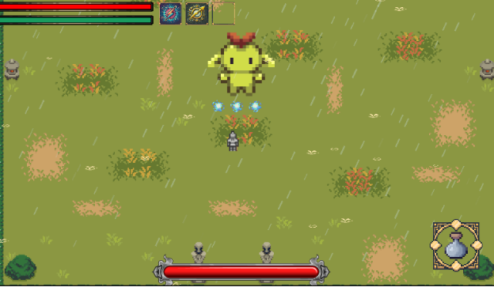
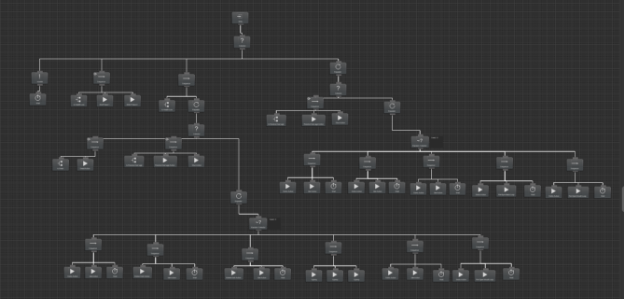
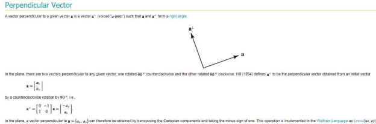
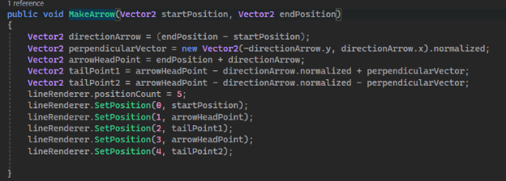
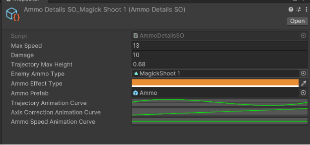

**Bermudos**

1. **Giới thiệu:**
   Bermudos là tựa game nghiêm túc đầu tiên của tôi, được phát triển sau khi hoàn thành khóa học *Unity 2D Dungeon Gunner Roguelike Development Course*. Đây là cách tôi áp dụng và nâng cao những kiến thức đã học.
1. **Thể loại:**
   Phiêu lưu, ARPG
1. **Cốt truyện:**
   Bermudos là một hòn đảo bí ẩn được cho là có thể ban tặng bất kỳ điều ước nào. Ryu, nhân vật chính của chúng ta, là một nhà thám hiểm đang tìm kiếm những bí ẩn của hòn đảo. Trong game, người chơi sẽ vào vai Ryu, khám phá Bermudos, đối mặt với thử thách và khám phá những bí mật ẩn giấu.
1. **Điểm Nhấn**
   1. ` `**AI Boss dùng Behaviour Tree:**

Trong dự án *Bermudos*, tôi đã sử dụng **Behavior Tree** để xây dựng AI cho boss. Tôi thiết kế boss có nhiều hành vi như phản ứng với sát thương, chuyển pha chiến đấu, lựa chọn kỹ năng dựa trên trạng thái của người chơi

**4.2 Kỹ năng đặc biệt: Bash**

Lấy cảm ứng từng Bash trong *Ori and the Blind Forest,* nhưng được tinh chỉnh lại cho phù hợp hơn hay còn gọi là parry tầm xa

Dùng LineRenderer: 

- Dùng công thức ảnh dưới để xác định tail của mũi tên 

` `

**4.3 Hệ Thống Điều hướng đi của Ammo: AnimationCurve + Normalization**

- Định nghĩa X và Y của Curve: có giá trị từ 0 tới 1.
- Ý tưởng: Evaluate giá trị y \* Khoảng cách từ viên đạn tới người chơi
- Một số vấn đề xảy ra:
1. Viên dạng không giải quyết được phần bù giữa người chơi và viên đạn vì nhân vật và người chơi không cùng đướng trên 1 trục x hay y

   **Giải quyết** bằng 1 curve thứ 2 Axis Correction

Ngoài ra: 

**Allin1Shader** giúp tạo các hiệu ứng đồ họa như glow, dissolve, hologram một cách dễ dàng.
**TMPEffect** hỗ trợ tạo hiệu ứng động cho TextMeshPro 
